# 모바일 + 서버 전체 시퀀스 다이어그램 + 클래스 설계

## 1. 전체 구성

### 주요 참여자
- Sender App
- Receiver App
- Secure Storage
- Offline Payment Engine
- Proof Signer
- Proof Verifier
- Server API
- Device Registry
- Collateral Service
- Settlement Engine
- Admin Console
- QR/BLE/NFC Channel

## 2. 시퀀스 다이어그램

### 2.1 기기 등록 + 공개키 등록

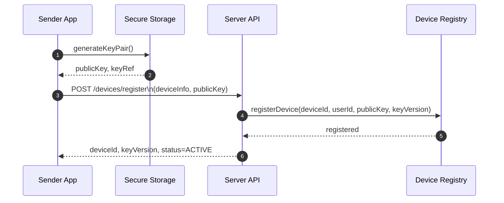

### 2.2 담보 잠금 + 오프라인 한도 발급

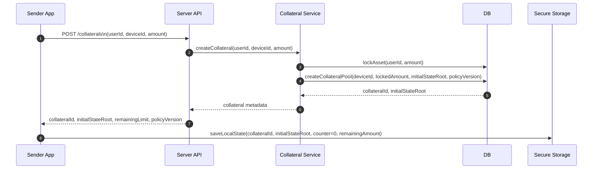

### 2.3 송신자 오프라인 바우처 생성

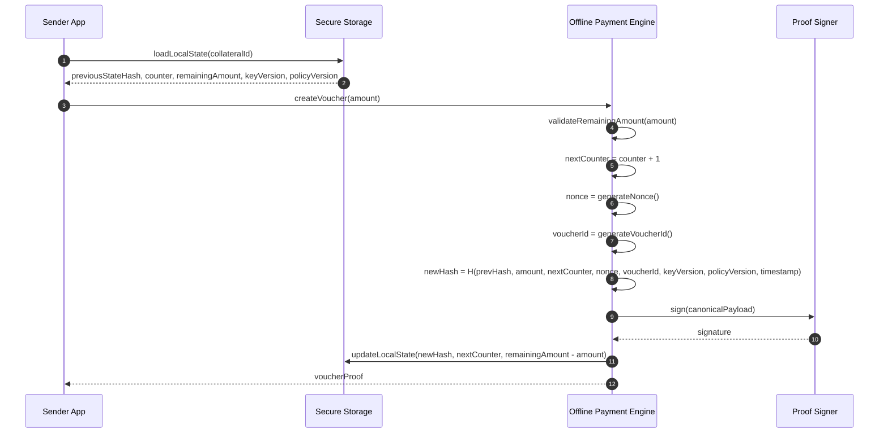

### 2.4 QR/BLE/NFC 전달 + 수신자 오프라인 검증

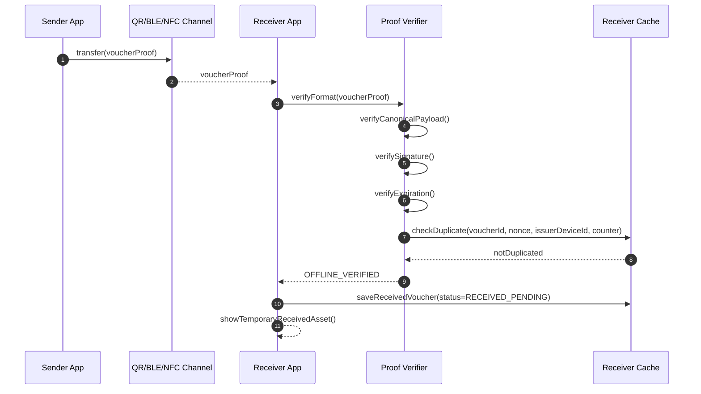

### 2.5 온라인 복귀 후 정산

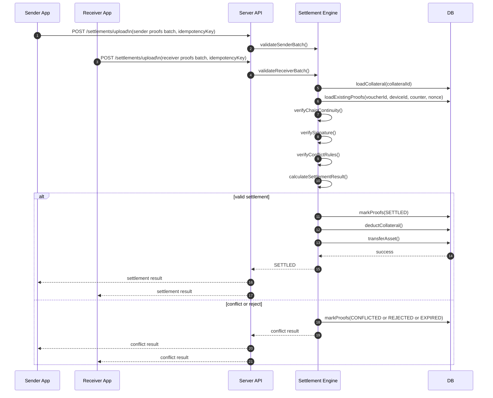

### 2.6 키 폐기 / 기기 폐기

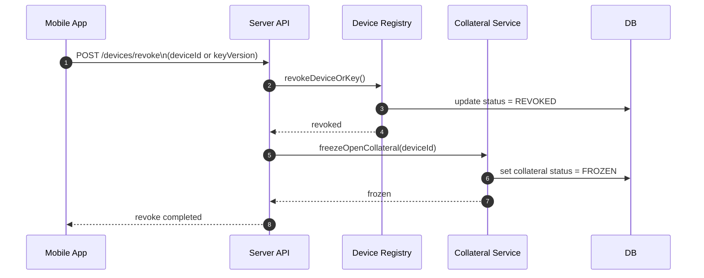

### 2.7 관리자 충돌 로그 조회

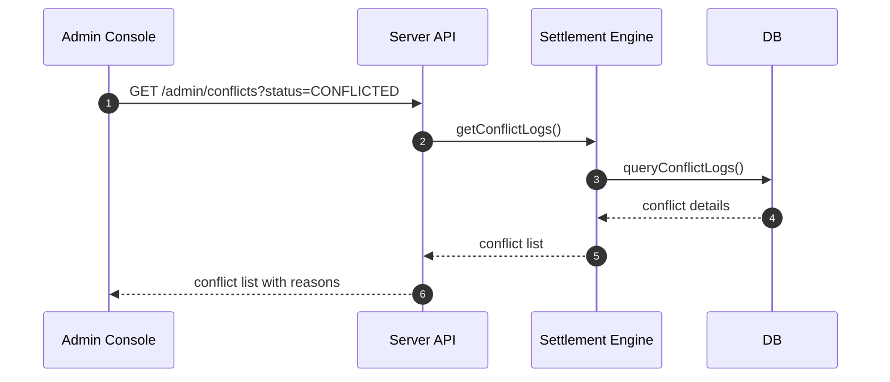

## 3. 상태 전이 다이어그램

오프라인 바우처 상태는 모바일 로컬 상태와 서버 최종 상태를 구분한다.

- 모바일 송신자는 바우처를 생성하고 로컬 상태를 전이시킨다.
- 모바일 수신자는 바우처의 형식, 서명, 만료, 중복 수령 여부까지만 검증한다.
- 서버는 업로드된 proof를 기준으로 충돌, 체인 연속성, 서명 유효성, 만료, 환불, 폐기 정책을 반영하여 최종 상태를 판정한다.
- 따라서 `OFFLINE_VERIFIED`는 확정 자산 상태가 아니며, 최종 자산 확정 상태는 `SETTLED`만 인정한다.

### 3.1 송신 바우처 상태

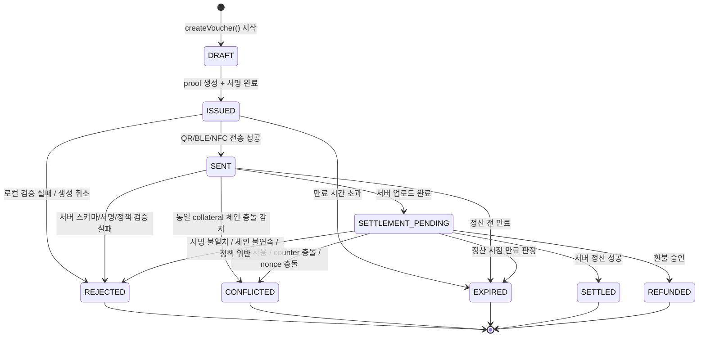

### 3.2 송신자 로컬 담보 상태

`VoucherStatus`와 `LocalCollateralState`는 같은 상태 머신이 아니다. 바우처 상태는 proof 단위 수명주기이고, 로컬 담보 상태는 송신자 단말이 보유한 collateral snapshot의 동기화 상태다.

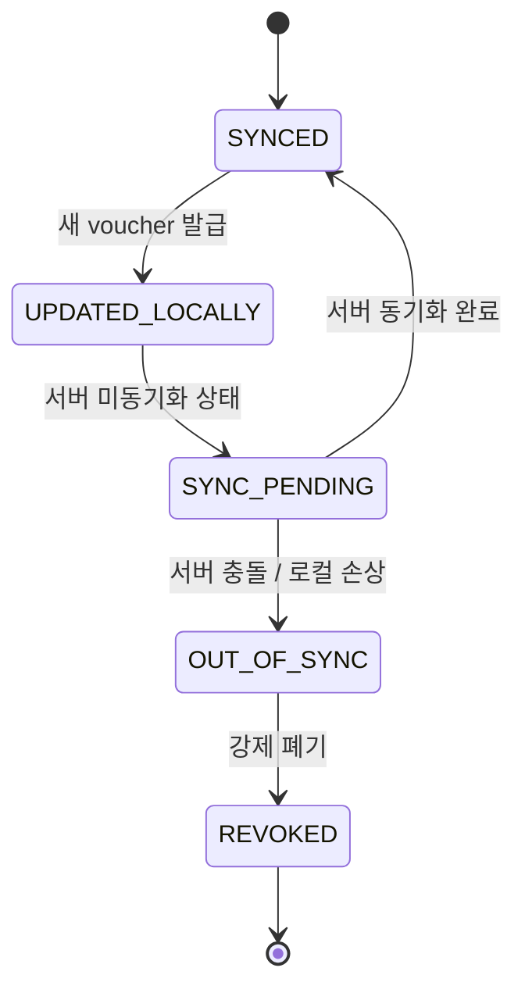

### 3.3 수신 바우처 상태

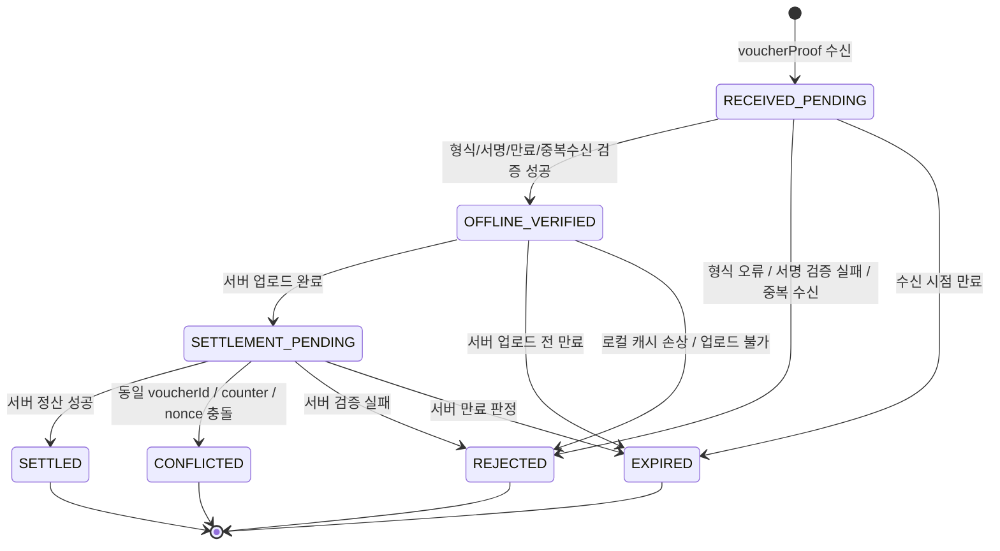

### 3.4 Device / Key 상태

기기 활성 상태와 키 수명주기는 바우처 상태와 별도로 관리해야 한다. 운영 디버깅 관점에서는 `device status`와 `key lifecycle`을 분리해서 보는 편이 낫다.

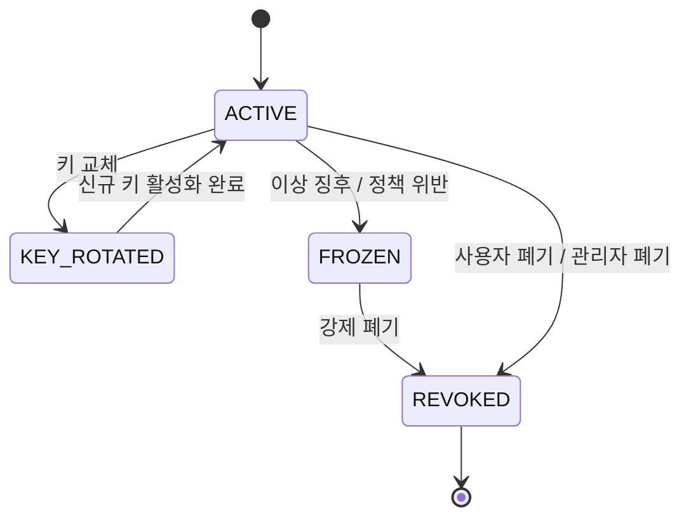

### 3.5 정산 배치 상태

proof 단건 상태와 별도로 업로드 배치 상태를 관리하면 운영에서 재시도, 부분 실패, 정산 집계를 다루기 쉬워진다.

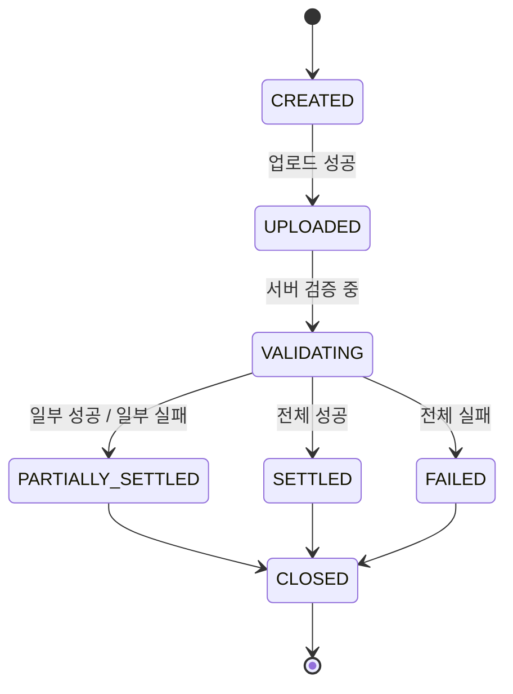

## 4. 클래스 설계

### 4.1 공통 도메인 모델

```java
public class VoucherProof {
    private String voucherId;
    private String collateralId;
    private String issuerDeviceId;
    private int keyVersion;
    private int policyVersion;
    private String prevHash;
    private String newHash;
    private java.math.BigDecimal amount;
    private long counter;
    private String nonce;
    private long timestamp;
    private byte[] signature;
}

public class LocalCollateralState {
    private String deviceId;
    private String collateralId;
    private java.math.BigDecimal remainingAmount;
    private long counter;
    private String previousStateHash;
    private int keyVersion;
    private int policyVersion;
    private long lastSyncAt;
    private boolean revoked;
}

public enum LocalCollateralSyncStatus {
    SYNCED,
    UPDATED_LOCALLY,
    SYNC_PENDING,
    OUT_OF_SYNC,
    REVOKED
}

public enum VoucherStatus {
    DRAFT,
    ISSUED,
    SENT,
    RECEIVED_PENDING,
    OFFLINE_VERIFIED,
    SETTLEMENT_PENDING,
    SETTLED,
    REJECTED,
    CONFLICTED,
    EXPIRED,
    REFUNDED
}

public enum SettlementBatchStatus {
    CREATED,
    UPLOADED,
    VALIDATING,
    PARTIALLY_SETTLED,
    SETTLED,
    FAILED,
    CLOSED
}
```

### 4.2 모바일 클래스 설계

#### `SecureStateStore`

```java
public interface SecureStateStore {
    LocalCollateralState loadState(String collateralId);
    void saveState(LocalCollateralState state);
    void updateState(String collateralId, String newHash, long counter, java.math.BigDecimal remainingAmount);
    void revokeState(String collateralId);
}
```

구현 예:
- `AndroidKeystoreStateStore`
- `IOSKeychainStateStore`

#### `KeyManager`

```java
public interface KeyManager {
    DeviceKeyInfo generateKeyPair();
    byte[] sign(byte[] payload);
    java.security.PublicKey getPublicKey();
    int getKeyVersion();
}

public class DeviceKeyInfo {
    private String deviceId;
    private java.security.PublicKey publicKey;
    private int keyVersion;
}
```

#### `CanonicalSerializer`

```java
public interface CanonicalSerializer {
    byte[] serializeVoucher(VoucherProof proof);
}
```

구현 예:
- `DeterministicJsonSerializer`
- `CborSerializer`

#### `VoucherHashGenerator`

```java
public interface VoucherHashGenerator {
    String generateNewHash(
        String prevHash,
        java.math.BigDecimal amount,
        long counter,
        String nonce,
        String voucherId,
        int keyVersion,
        int policyVersion,
        long timestamp
    );
}
```

#### `NonceGenerator`

```java
public interface NonceGenerator {
    String generateNonce();
    String generateVoucherId();
}
```

#### `OfflinePaymentEngine`

```java
public class OfflinePaymentEngine {

    private final SecureStateStore secureStateStore;
    private final VoucherHashGenerator hashGenerator;
    private final CanonicalSerializer serializer;
    private final KeyManager keyManager;
    private final NonceGenerator nonceGenerator;

    public OfflinePaymentEngine(
        SecureStateStore secureStateStore,
        VoucherHashGenerator hashGenerator,
        CanonicalSerializer serializer,
        KeyManager keyManager,
        NonceGenerator nonceGenerator
    ) {
        this.secureStateStore = secureStateStore;
        this.hashGenerator = hashGenerator;
        this.serializer = serializer;
        this.keyManager = keyManager;
        this.nonceGenerator = nonceGenerator;
    }

    public VoucherProof createVoucher(String collateralId, java.math.BigDecimal amount) {
        // 1. state load
        // 2. amount validate
        // 3. nextCounter, nonce, voucherId 생성
        // 4. newHash 생성
        // 5. proof 생성
        // 6. canonical serialize
        // 7. sign
        // 8. local state update
        // 9. proof 반환
        return null;
    }
}
```

#### `ProofVerifier`

```java
public class ProofVerifier {

    private final CanonicalSerializer serializer;
    private final SignatureVerifier signatureVerifier;
    private final DuplicateVoucherChecker duplicateVoucherChecker;
    private final ExpirationPolicy expirationPolicy;

    public ProofVerifier(
        CanonicalSerializer serializer,
        SignatureVerifier signatureVerifier,
        DuplicateVoucherChecker duplicateVoucherChecker,
        ExpirationPolicy expirationPolicy
    ) {
        this.serializer = serializer;
        this.signatureVerifier = signatureVerifier;
        this.duplicateVoucherChecker = duplicateVoucherChecker;
        this.expirationPolicy = expirationPolicy;
    }

    public VerificationResult verifyOffline(VoucherProof proof, java.security.PublicKey issuerPublicKey) {
        // 1. format validation
        // 2. canonical serialization
        // 3. signature verification
        // 4. expiration check
        // 5. duplicate receiving check
        return null;
    }
}
```

#### 기타 모바일 구성요소

```java
public interface SignatureVerifier {
    boolean verify(byte[] payload, byte[] signature, java.security.PublicKey publicKey);
}

public interface DuplicateVoucherChecker {
    boolean isDuplicate(String voucherId, String nonce, String issuerDeviceId, long counter);
    void markReceived(VoucherProof proof);
}

public interface VoucherTransferManager {
    void send(VoucherProof proof);
    VoucherProof receive();
}
```

구현 예:
- `QrTransferManager`
- `BleTransferManager`
- `NfcTransferManager`

#### `SettlementSyncService`

```java
public class SettlementSyncService {
    public void uploadPendingProofs(java.util.List<VoucherProof> proofs, String idempotencyKey) {
        // pending proofs batch upload
    }
}
```

### 4.3 서버 클래스 설계

#### 도메인 모델

```java
public class Device {
    private String deviceId;
    private Long userId;
    private String publicKey;
    private int keyVersion;
    private DeviceStatus status;
}

public enum DeviceStatus {
    ACTIVE,
    REVOKED,
    FROZEN
}

public class CollateralPool {
    private String collateralId;
    private Long userId;
    private String deviceId;
    private java.math.BigDecimal lockedAmount;
    private java.math.BigDecimal remainingAmount;
    private String initialStateRoot;
    private int policyVersion;
    private CollateralStatus status;
}

public enum CollateralStatus {
    ACTIVE,
    FROZEN,
    SETTLED,
    CLOSED
}

public class SettlementResult {
    private String voucherId;
    private SettlementStatus status;
    private String reasonCode;
}

public enum SettlementStatus {
    SETTLED,
    REJECTED,
    CONFLICTED,
    EXPIRED,
    REFUNDED
}
```

#### 서비스 / 정책 구성요소

```java
public class DeviceRegistryService {

    public Device registerDevice(RegisterDeviceCommand command) {
        return null;
    }

    public void revokeDevice(String deviceId) {
    }

    public void rotateKey(String deviceId, int newKeyVersion, String publicKey) {
    }

    public Device getActiveDevice(String deviceId) {
        return null;
    }
}

public class CollateralService {

    public CollateralPool createCollateral(Long userId, String deviceId, java.math.BigDecimal amount) {
        return null;
    }

    public void freezeCollateralByDevice(String deviceId) {
    }

    public CollateralPool getCollateral(String collateralId) {
        return null;
    }
}

public class ProofSchemaValidator {
    public void validate(VoucherProof proof) {
        // 필수 필드, 길이, 형식, 버전 검증
    }
}

public class PublicKeyResolver {
    public java.security.PublicKey resolve(String issuerDeviceId, int keyVersion) {
        return null;
    }
}

public class SettlementPolicyEngine {
    public SettlementDecision decide(SettlementContext context) {
        return null;
    }
}

public class ProofChainValidator {
    public ChainValidationResult validateChain(CollateralPool collateral, java.util.List<VoucherProof> proofs) {
        return null;
    }
}

public class ConflictDetector {
    public ConflictResult detect(java.util.List<VoucherProof> incomingProofs, java.util.List<VoucherProof> existingProofs) {
        return null;
    }
}
```

#### `SettlementService`

```java
public class SettlementService {

    private final ProofSchemaValidator schemaValidator;
    private final ProofChainValidator chainValidator;
    private final ConflictDetector conflictDetector;
    private final SettlementPolicyEngine policyEngine;

    public SettlementService(
        ProofSchemaValidator schemaValidator,
        ProofChainValidator chainValidator,
        ConflictDetector conflictDetector,
        SettlementPolicyEngine policyEngine
    ) {
        this.schemaValidator = schemaValidator;
        this.chainValidator = chainValidator;
        this.conflictDetector = conflictDetector;
        this.policyEngine = policyEngine;
    }

    public java.util.List<SettlementResult> settleProofBatch(SettlementBatchCommand command) {
        // 1. validate schema
        // 2. load collateral/device/public key
        // 3. detect conflict
        // 4. validate chain
        // 5. apply policy
        // 6. persist results
        return null;
    }
}
```

#### 기타 서버 구성요소

```java
public class NonceReplayService {
    public boolean exists(String nonce, String issuerDeviceId) {
        return false;
    }

    public void save(String nonce, String issuerDeviceId, String voucherId) {
    }
}

public class RefundService {
    public void requestRefund(String voucherId) {
    }

    public void approveRefund(String voucherId) {
    }
}

public class ConflictLogService {
    public java.util.List<ConflictLog> getConflicts(ConflictSearchCondition condition) {
        return null;
    }

    public ConflictLog getConflictDetail(String conflictId) {
        return null;
    }
}
```

## 5. 패턴 적용 포인트

### 5.1 전략 패턴: 전송 채널 분리

```java
public interface TransferStrategy {
    void send(VoucherProof proof);
    VoucherProof receive();
}

public class QrTransferStrategy implements TransferStrategy {
    @Override
    public void send(VoucherProof proof) {
    }

    @Override
    public VoucherProof receive() {
        return null;
    }
}

public class BleTransferStrategy implements TransferStrategy {
    @Override
    public void send(VoucherProof proof) {
    }

    @Override
    public VoucherProof receive() {
        return null;
    }
}

public class NfcTransferStrategy implements TransferStrategy {
    @Override
    public void send(VoucherProof proof) {
    }

    @Override
    public VoucherProof receive() {
        return null;
    }
}
```

### 5.2 팩토리 패턴: 전송 방식 생성

```java
public class TransferStrategyFactory {

    public static TransferStrategy get(String type) {
        return switch (type) {
            case "QR" -> new QrTransferStrategy();
            case "BLE" -> new BleTransferStrategy();
            case "NFC" -> new NfcTransferStrategy();
            default -> throw new IllegalArgumentException("Unsupported transfer type");
        };
    }
}
```

### 5.3 템플릿 메서드: 정산 공통 흐름

```java
public abstract class AbstractSettlementProcessor {

    public final java.util.List<SettlementResult> process(SettlementBatchCommand command) {
        validateSchema(command);
        loadContext(command);
        detectConflict(command);
        validateChain(command);
        applyPolicy(command);
        return persist(command);
    }

    protected abstract void validateSchema(SettlementBatchCommand command);
    protected abstract void loadContext(SettlementBatchCommand command);
    protected abstract void detectConflict(SettlementBatchCommand command);
    protected abstract void validateChain(SettlementBatchCommand command);
    protected abstract void applyPolicy(SettlementBatchCommand command);
    protected abstract java.util.List<SettlementResult> persist(SettlementBatchCommand command);
}
```

## 6. 패키지 구조 예시

### 서버

```text
server/
 ├─ api/
 │   ├─ device/
 │   ├─ collateral/
 │   ├─ settlement/
 │   └─ admin/
 ├─ application/
 │   ├─ device/
 │   ├─ collateral/
 │   ├─ settlement/
 │   ├─ refund/
 │   └─ conflict/
 ├─ domain/
 │   ├─ device/
 │   ├─ collateral/
 │   ├─ proof/
 │   ├─ settlement/
 │   └─ policy/
 ├─ infrastructure/
 │   ├─ persistence/
 │   ├─ crypto/
 │   ├─ serializer/
 │   └─ logging/
 └─ common/
```

### 모바일

```text
mobile/
 ├─ app/
 │   ├─ registration/
 │   ├─ collateral/
 │   ├─ payment/
 │   ├─ receive/
 │   └─ settlement/
 ├─ domain/
 │   ├─ voucher/
 │   ├─ state/
 │   └─ policy/
 ├─ infrastructure/
 │   ├─ securestore/
 │   ├─ crypto/
 │   ├─ serializer/
 │   ├─ transport/
 │   └─ api/
 └─ common/
```

## 7. 구현 우선순위

### 1차 PoC
- `DeviceRegistryService`
- `CollateralService`
- `OfflinePaymentEngine`
- `ProofVerifier`
- `QrTransferStrategy`
- `SettlementService`
- `ConflictLogService` 최소 버전

### 2차
- BLE/NFC 전송
- 키 폐기/교체
- 환불 정책
- 관리자 상세 화면

### 3차
- attestation
- risk scoring
- 고도화된 충돌 판정

## 8. 핵심 설계 요약

### 모바일
- 송신자: 로컬 상태 전이 + 서명
- 수신자: 형식, 서명, 만료, 중복 수령 여부만 오프라인 검증
- 수신 자산: 정산 전 임시 상태

### 서버
- 서버가 최종 진실 원장
- 정산, 충돌, 만료, 폐기, 환불, 시간 위조 판정은 서버 정책 책임
- 오프라인 proof는 확정 자산이 아니라 정산 후보 데이터
